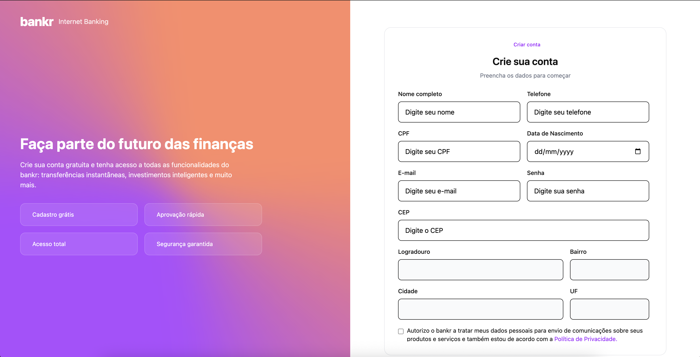
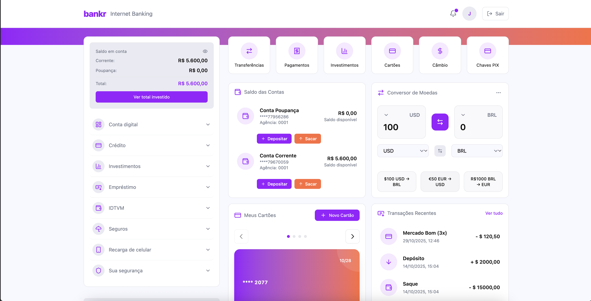
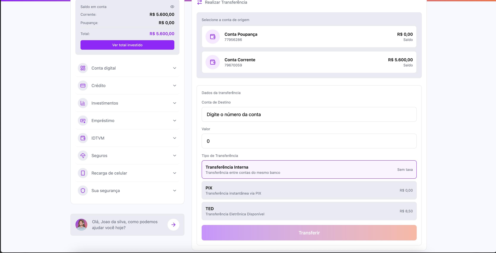
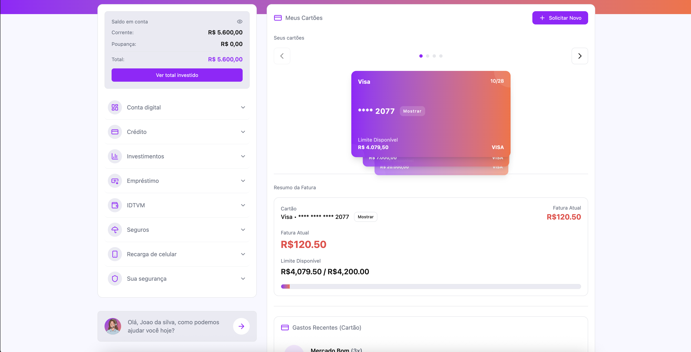
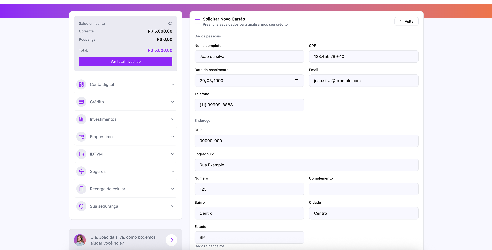
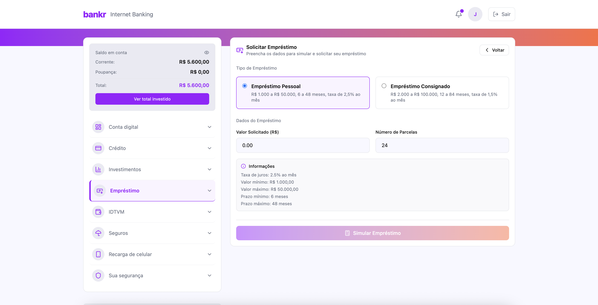
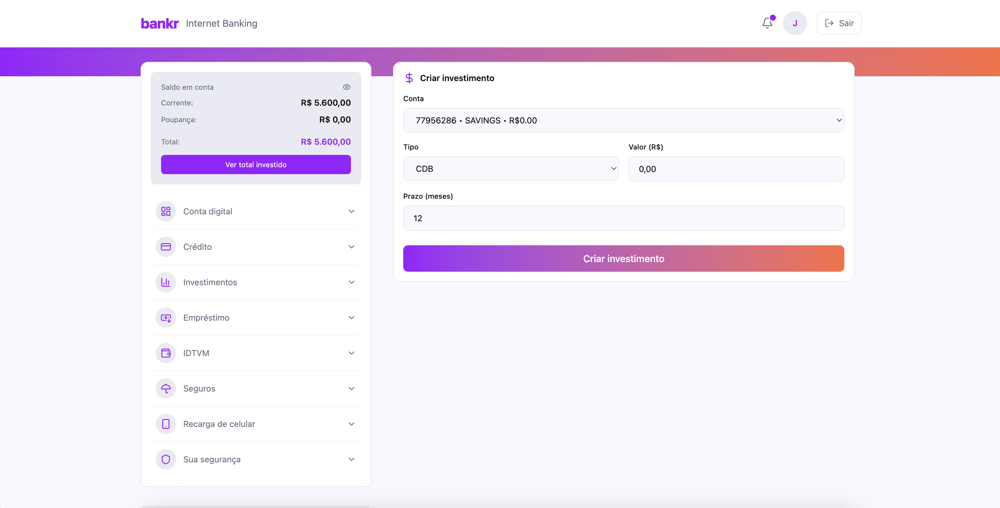
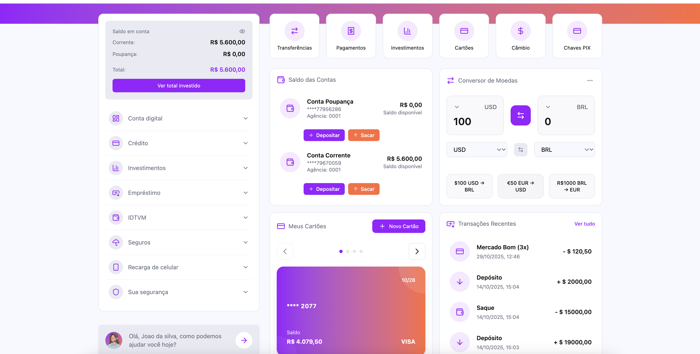
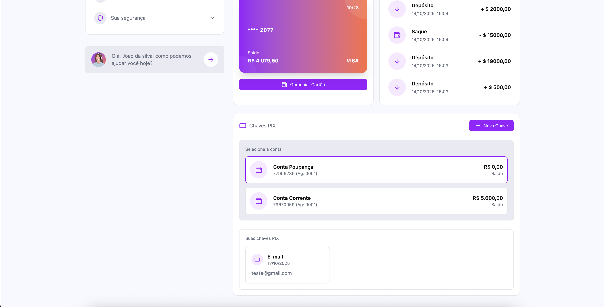
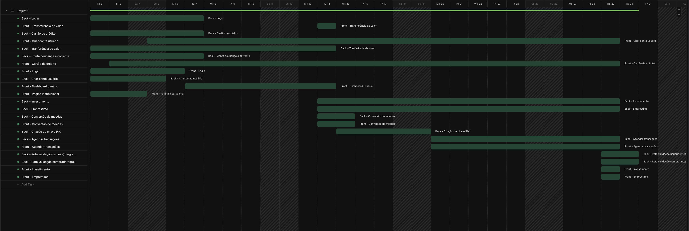

# Bankr - Sistema de Internet Banking

<div align="center">


**Sistema completo de Internet Banking desenvolvido com Angular e Spring Boot**

[](https://angular.io/)
[](https://spring.io/projects/spring-boot)
[](https://www.oracle.com/java/)
[](https://www.typescriptlang.org/)
[](https://www.postgresql.org/)

</div>

---

## Índice

- [Sobre o Projeto](#sobre-o-projeto)
- [Equipe](#equipe)
- [Tecnologias Utilizadas](#tecnologias-utilizadas)
- [Funcionalidades](#funcionalidades)
- [Sprints](#sprints)
- [Gráfico de GANTT](#gráfico-de-gantt)
- [Acesso ao Sistema](#acesso-ao-sistema)
- [Como Executar](#como-executar)
- [Estrutura do Projeto](#estrutura-do-projeto)

---

## Sobre o Projeto

O **Bankr** é um sistema completo de Internet Banking desenvolvido como projeto final do curso +devs2blu. A aplicação oferece uma experiência moderna e intuitiva para gerenciamento financeiro, permitindo que os usuários realizem diversas operações bancárias de forma segura e eficiente.

### Objetivos

- Fornecer uma plataforma completa de Internet Banking
- Implementar funcionalidades bancárias essenciais
- Garantir segurança e performance
- Oferecer interface moderna e responsiva

---

## Equipe

### Integrantes

- **Jean Jacintho**
- **Marcelo Calsing**
- **Nicolas Rotta**
- **Matheus Citadini**
- **Ronan Kroeger**

---

## Tecnologias Utilizadas

### Frontend
- **Angular 20.3.6** - Framework principal
- **TypeScript 5.9.2** - Linguagem de programação
- **Tailwind CSS 4.1.14** - Framework CSS utilitário
- **Lucide Angular** - Biblioteca de ícones
- **RxJS** - Programação reativa

### Backend
- **Spring Boot 3.5.6** - Framework Java
- **Java 17** - Linguagem de programação
- **Spring Security** - Autenticação e autorização
- **Spring Data JPA** - Persistência de dados
- **JWT (Auth0)** - Autenticação baseada em tokens
- **SpringDoc OpenAPI** - Documentação da API

### Banco de Dados
- **PostgreSQL 16** - Banco de dados relacional
- **H2 Database** - Banco de dados em memória (desenvolvimento)

### DevOps & Infraestrutura
- **Docker** - Containerização
- **Docker Compose** - Orquestração de containers
- **GitHub Actions** - CI/CD
- **Render** - Deploy e hospedagem

---

## Funcionalidades

### 1. Autenticação e Segurança

#### Login
- Autenticação segura com JWT
- Validação de credenciais
- Gerenciamento de sessão


*Tela de login com validação de credenciais e design moderno*

#### Registro de Usuário
- Cadastro completo de novos usuários
- Validação de dados
- Integração com API de CEP para endereço


*Formulário de registro com validação em tempo real*

---

### 2. Dashboard

- Visão geral das contas bancárias
- Saldo consolidado
- Histórico de transações recentes
- Acesso rápido às principais funcionalidades
- Conversor de moedas integrado
- Gerenciamento de chaves PIX


*Dashboard principal com informações consolidadas e acesso rápido*

---

### 3. Contas Bancárias

- Visualização de todas as contas
- Detalhes de cada conta
- Criação de novas contas
- Histórico de movimentações

*Gerenciamento completo de contas bancárias*

---

### 4. Transferências

- Transferências entre contas próprias
- Transferências para terceiros via PIX
- Histórico completo de transferências
- Validação de saldo e limites


*Interface para realização de transferências*

---

### 5. Cartão de Crédito

#### Dashboard do Cartão
- Visualização de fatura atual
- Limite disponível
- Histórico de transações
- Resumo de gastos por categoria


*Dashboard do cartão de crédito com informações detalhadas*

#### Solicitação de Cartão
- Formulário de solicitação
- Análise de crédito
- Acompanhamento do status


*Formulário para solicitação de cartão de crédito*

---

### 6. Empréstimos

#### Listagem de Empréstimos
- Visualização de todos os empréstimos contratados
- Status de cada empréstimo
- Detalhes de parcelas


*Lista de empréstimos contratados*

#### Solicitação de Empréstimo
- Simulação de empréstimo
- Tipos disponíveis (Pessoal, Consignado)
- Cálculo de parcelas e juros
- Solicitação online


*Formulário para simulação e solicitação de empréstimo*

---

### 7. Investimentos

#### Listagem de Investimentos
- Visualização de investimentos ativos
- Performance e rentabilidade
- Histórico de aplicações


*Lista de investimentos do usuário*

#### Aplicação em Investimentos
- Formulário de aplicação
- Tipos de investimento disponíveis
- Simulação de rentabilidade


*Interface para aplicação em investimentos*

---

### 8. Conversão de Moedas

- Conversão em tempo real
- Múltiplas moedas suportadas
- Taxa de câmbio atualizada
- Histórico de conversões


*Conversor de moedas com taxas atualizadas*

---

### 9. Chaves PIX

- Cadastro de chaves PIX
- Gerenciamento de chaves (CPF, Email, Telefone, Aleatória)
- Exclusão de chaves
- Listagem de todas as chaves cadastradas


*Gerenciamento completo de chaves PIX*

---


## Sprints

O projeto foi desenvolvido utilizando metodologia ágil SCRUM, dividido em sprints por funcionalidade.

link para sprints no clickup

Grant:
https://sharing.clickup.com/90132558517/g/h/2ky53cnn-593/cf594c2ca492286

Board:
https://sharing.clickup.com/90132558517/b/h/2ky53cnn-513/12e04de695f0349

## Gráfico de GANTT

O gráfico de GANTT abaixo apresenta a visão geral do cronograma do projeto, mostrando as atividades de cada sprint e suas dependências.



---

## Acesso ao Sistema

### URL de Produção

O sistema está disponível em produção através do seguinte endereço:

**Frontend:** [https://bankr-web.onrender.com/](https://bankr-web.onrender.com/)

### Credenciais de Teste

Para testar o sistema, utilize as seguintes credenciais:

| Campo | Valor |
|-------|-------|
| **Nome** | Usuario Teste |
| **CPF** | 37076094053 |
| **Email** | teste@bankr.com (CHAVE PIX) |
| **Senha** | Senha123@ |
| **Número do Cartão** | 4001302606394832 |
| **Validade do Cartão** | 10/2028 |

---

## Como Executar

### Pré-requisitos

- Node.js 18+ e npm
- Java 17+
- Maven 3.6+
- PostgreSQL 16+
- Docker e Docker Compose (opcional)

### Instalação

1. **Clone o repositório**
```bash
git clone https://github.com/seu-usuario/banking-final-angular.git
cd banking-final-angular
```

2. **Configure o banco de dados**

Crie um banco de dados PostgreSQL e atualize as configurações em `api/src/main/resources/application.properties`:

```properties
spring.datasource.url=jdbc:postgresql://localhost:5432/banking_db
spring.datasource.username=seu_usuario
spring.datasource.password=sua_senha
```

3. **Execute o Backend**

```bash
cd api
./mvnw spring-boot:run
```

O backend estará disponível em `http://localhost:8080`

4. **Execute o Frontend**

```bash
cd web
npm install
npm start
```

O frontend estará disponível em `http://localhost:4200`

### Executando com Docker

```bash
docker-compose up -d
```

---

## Estrutura do Projeto

```
banking-final-angular/
├── api/                          # Backend Spring Boot
│   ├── src/
│   │   ├── main/
│   │   │   ├── java/
│   │   │   │   └── com/devstoblu/banking_system/
│   │   │   │       ├── controllers/    # Controllers REST
│   │   │   │       ├── services/       # Lógica de negócio
│   │   │   │       ├── models/         # Entidades JPA
│   │   │   │       ├── dto/            # Data Transfer Objects
│   │   │   │       ├── repositories/   # Repositórios JPA
│   │   │   │       └── security/       # Configuração de segurança
│   │   │   └── resources/
│   │   │       └── application.properties
│   │   └── test/                       # Testes
│   └── pom.xml
├── web/                          # Frontend Angular
│   ├── src/
│   │   ├── app/
│   │   │   ├── components/       # Componentes reutilizáveis
│   │   │   ├── pages/            # Páginas da aplicação
│   │   │   ├── services/         # Serviços Angular
│   │   │   ├── interceptors/     # Interceptores HTTP
│   │   │   └── models/          # Modelos TypeScript
│   │   ├── assets/               # Assets estáticos
│   │   └── environments/         # Configurações de ambiente
│   └── package.json
├── infra/                        # Infraestrutura
│   ├── docker/                   # Dockerfiles
│   ├── compose/                  # Docker Compose
│   └── ci-cd/                    # Configuração CI/CD
├── docs/                         # Documentação
│   └── images/                   # Imagens do README
└── README.md                     # Este arquivo
```

---

## Documentação de Rotas

### Rotas da API (Backend)

Base URL: `http://localhost:8080/api`

#### Autenticação
| Método | Rota | Descrição | Autenticação |
|--------|------|-----------|--------------|
| POST | `/api/auth/login` | Realizar login e obter token JWT | Não |

#### Usuários
| Método | Rota | Descrição | Autenticação |
|--------|------|-----------|--------------|
| GET | `/api/usuarios` | Listar todos os usuários | Sim |
| GET | `/api/usuarios/me` | Obter dados do usuário autenticado | Sim |
| GET | `/api/usuarios/{id}` | Obter usuário por ID | Sim |
| POST | `/api/usuarios` | Criar novo usuário | Não |
| PUT | `/api/usuarios/{id}` | Atualizar usuário | Sim |

#### Contas Bancárias
| Método | Rota | Descrição | Autenticação |
|--------|------|-----------|--------------|
| GET | `/api/account` | Listar todas as contas | Sim |
| GET | `/api/account/my-accounts` | Obter contas do usuário autenticado | Sim |
| GET | `/api/account/my-transactions` | Obter transações do usuário | Sim |
| GET | `/api/account/checking` | Listar contas corrente | Sim |
| GET | `/api/account/savings` | Listar contas poupança | Sim |
| GET | `/api/account/{accountNumber}` | Obter conta por número | Sim |
| POST | `/api/account/checking/{userId}` | Criar conta corrente | Sim |
| POST | `/api/account/savings/{userId}` | Criar conta poupança | Sim |
| POST | `/api/account/deposit/{accountNumber}` | Realizar depósito | Sim |
| POST | `/api/account/withdraw/{accountNumber}` | Realizar saque | Sim |
| POST | `/api/account/transfer` | Realizar transferência | Sim |
| DELETE | `/api/account/{accountNumber}` | Deletar conta | Sim |

#### PIX
| Método | Rota | Descrição | Autenticação |
|--------|------|-----------|--------------|
| POST | `/api/pix/keys` | Cadastrar chave PIX | Sim |
| GET | `/api/pix/keys` | Listar chaves PIX por conta | Sim |
| DELETE | `/api/pix/keys/{id}` | Deletar chave PIX por ID | Sim |
| POST | `/api/pix/keys/delete` | Deletar chave PIX por tipo e valor | Sim |
| POST | `/api/pix/resolve` | Resolver chave PIX (encontrar conta) | Sim |

#### Cartão de Crédito
| Método | Rota | Descrição | Autenticação |
|--------|------|-----------|--------------|
| GET | `/api/credit-cards` | Listar todos os cartões | Sim |
| GET | `/api/credit-cards/my-cards` | Obter cartões do usuário | Sim |
| GET | `/api/credit-cards/number/{cardNumber}` | Obter cartão por número | Sim |
| GET | `/api/credit-cards/{id}` | Obter cartão por ID | Sim |
| GET | `/api/credit-cards/{id}/cvv` | Obter CVV do cartão | Sim |
| POST | `/api/credit-cards` | Criar cartão | Sim |
| POST | `/api/credit-cards/requests` | Solicitar cartão de crédito | Sim |
| PUT | `/api/credit-cards/{id}` | Atualizar cartão | Sim |
| DELETE | `/api/credit-cards/{id}` | Deletar cartão | Sim |

#### Empréstimos
| Método | Rota | Descrição | Autenticação |
|--------|------|-----------|--------------|
| GET | `/api/loans` | Listar empréstimos (opcional: ?userId=) | Sim |
| GET | `/api/loans/{id}` | Obter empréstimo por ID | Sim |
| POST | `/api/loans/simulate` | Simular empréstimo | Sim |
| POST | `/api/loans/request` | Solicitar empréstimo | Sim |

#### Investimentos
| Método | Rota | Descrição | Autenticação |
|--------|------|-----------|--------------|
| GET | `/api/investment` | Listar todos os investimentos | Sim |
| GET | `/api/investment/my` | Obter investimentos do usuário | Sim |
| POST | `/api/investment/cdb/{accountNumber}` | Criar investimento CDB | Sim |
| POST | `/api/investment/renda-fixa/{accountNumber}` | Criar investimento Renda Fixa | Sim |
| POST | `/api/investment/apply/{accountNumber}` | Aplicar taxa de investimento | Sim |
| POST | `/api/investment/withdraw/{accountNumber}/{id}` | Resgatar investimento | Sim |
| DELETE | `/api/investment/cdb/{accountNumber}/{id}` | Deletar investimento CDB | Sim |

#### Conversão de Moedas
| Método | Rota | Descrição | Autenticação |
|--------|------|-----------|--------------|
| POST | `/api/currency/convert` | Converter moeda | Sim |
| GET | `/api/currency/supported` | Listar moedas suportadas | Sim |

#### Health Check
| Método | Rota | Descrição | Autenticação |
|--------|------|-----------|--------------|
| GET | `/api/ping` | Verificar status da API | Não |
| GET | `/api/health-check` | Health check completo | Não |
| GET | `/api/status` | Status simples | Não |

---

### Rotas do Frontend (Angular)

Base URL: `http://localhost:4200`

#### Públicas
| Rota | Componente | Descrição |
|------|------------|-----------|
| `/` | Home | Página inicial |
| `/login` | Login | Tela de login |
| `/register` | Register | Tela de registro |

#### Autenticadas
| Rota | Componente | Descrição |
|------|------------|-----------|
| `/dashboard` | Dashboard | Dashboard principal |
| `/transfers` | TransfersPage | Página de transferências |
| `/credit-card` | CreditCardDashboardComponent | Dashboard do cartão de crédito |
| `/credit-card/request` | CreditCardRequestComponent | Solicitar cartão de crédito |
| `/loans` | LoansPage | Lista de empréstimos |
| `/loans/request` | LoanRequestComponent | Solicitar empréstimo |
| `/investiments` | InvestmentsListPage | Lista de investimentos |
| `/investiment/request` | InvestmentsPage | Aplicar em investimento |
| `/currency` | CurrencyPage | Conversor de moedas |
| `/pix-keys` | PixKeysPage | Gerenciamento de chaves PIX |
| `/payments` | PaymentsPage | Página de pagamentos |

---

## Documentação da API

A documentação completa da API está disponível através do Swagger/OpenAPI:

- **Desenvolvimento:** http://localhost:8080/swagger-ui.html
- **Produção:** [URL da API]/swagger-ui.html

---

## Licença

Este projeto foi desenvolvido como projeto final do curso +devs2blu.

---

<div align="center">

**Desenvolvido pela equipe Bankr**

[Voltar ao topo](#bankr---sistema-de-internet-banking)

</div>

